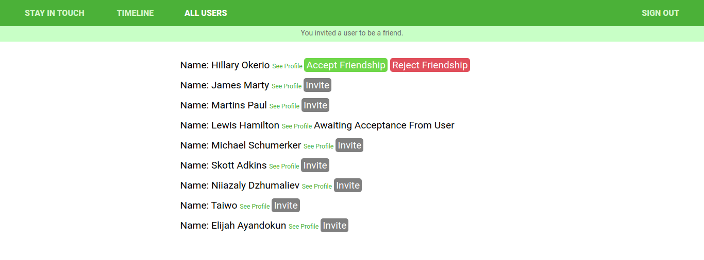

# Simple social media app with Ruby on Rails

> This is a microverse ruby on rails project that includes coming up with a simple working social media web app. The app includes user signing up, login, sending friend request , accepting or rejecting and posting content.

## Screenshot



## Built With

- Ruby v2.7.0
- Ruby on Rails v5.2.4
- Devise

## Live Demo

[Live link](https://agile-lowlands-64878.herokuapp.com/users/sign_in)


## Getting Started

To get a local copy up and running follow these simple example steps.

### Prerequisites

Ruby: 2.6.3
Rails: 5.2.3
Postgres: >=9.5

### Setup

Instal gems with:

```
bundle install
```

Setup database with:

```
   rails db:create
   rails db:migrate
```


### Usage

Start server with:

```
    rails server
```

Open `http://localhost:3000/` in your browser.

### Run tests

```
    rpsec --format documentation
```

> Tests will be added by Microverse students. There are no tests for initial features in order to make sure that students write all tests from scratch.


## Author 1

- Github: [@NiiazalyDzhumaliev](https://github.com/NiiazalyDzhumaliev)
- Twitter: [@Niiazaly1](https://twitter.com/Niiazaly1)
- Linkedin: [Niiazaly Dzhumaliev ](https://www.linkedin.com/in/niiazaly-dzhumaliev-117707132/)

## Author 2

- Github: [@hillarioh](https://github.com/hillarioh)
- Twitter: [@hillaokri](https://twitter.com/hillaokri)
- Linkedin: [@HillaryOkerio](https://www.linkedin.com/in/hillaryokerio/)

## Show your support

Give a ⭐️ if you like this project!

## 🤝 Contributing

Contributions, issues and feature requests are welcome!

Feel free to check the [issues page](issues/).


## Acknowledgments

This is a Microverse project done by students, it was initializated by another student and continuated by us.


